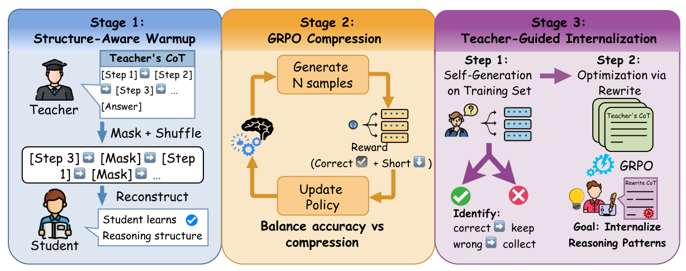

# BRIDGE: Bridging Reasoning In Distillation Gap Elimination via Structure-Aware Masking

Official implementation of our **SDM 2026** paper — the core three-stage curriculum for
distilling long Chain-of-Thought (CoT) reasoning from a large teacher into a compact
**Qwen2.5-3B** student, improving accuracy while compressing output length.

<p align="center">
  <a href="https://arxiv.org/abs/2602.17686"></a>
  <a href="https://huggingface.co/bowen0815/BRIDGE"></a>
  <a href="LICENSE"></a>
</p>

<p align="center">
  
</p>

## Overview

BRIDGE trains a small student through a three-stage curriculum:

1. **Stage 1 — Structure-aware SFT.** The student learns the step-structured CoT format and
   becomes robust to step ordering, via masked + shuffled reconstruction on teacher CoT.
2. **Stage 2 — GRPO with mask recovery (core).** Group Relative Policy Optimization with
   scattered step-masking teaches the student to compress reasoning while a hierarchical
   reward preserves correctness.
3. **Stage 3 — Teacher-guided concise rewrite (GRPO).** On the hard cases Stage 2 still gets
   wrong, the student learns to rewrite the teacher's CoT concisely — producing the final model.

On GSM8K, BRIDGE lifts **Qwen2.5-3B from 64.90% → 76.19%** while cutting average output length
**from 230 → 167 tokens**.

## Repository layout

```
.
├── scripts/
│   ├── train_stage1_sft_v2.py    # Stage 1: structure-aware SFT (mask + shuffle)
│   ├── train_grpo.py             # Stage 2: GRPO with mask recovery (core method)
│   ├── train_grpo_rewrite.py     # Stage 3: GRPO teacher-guided concise rewrite -> final model
│   ├── data_processor_phase1.py  # Stage 1 data pipeline (mask one step + always shuffle)
│   ├── data_processor.py         # Stage 2 data pipeline (scattered mask recovery)
│   └── eval_gsm8k.py             # GSM8K evaluation (accuracy + avg tokens)
├── configs/
│   ├── stage1_sft_v2.yaml        # Stage 1 hyperparameters
│   ├── stage2_grpo.yaml          # Stage 2 hyperparameters
│   └── stage3_rewrite_grpo_v2.yaml  # Stage 3 hyperparameters
├── data/
│   ├── phase1_unified_clean.jsonl   # Stage 1/2 training data (teacher CoT, 6128 rows)
│   └── stage3_error_samples.json    # Stage 3 hard cases w/ teacher CoT (568 rows)
├── assets/framework.png
├── requirements.txt
├── citation.bib
└── README.md
```

## Setup

```bash
pip install -r requirements.txt
```

## Data

Both files under `data/` are the **real training data** used in the paper:

- **`phase1_unified_clean.jsonl`** (6128 rows) — step-formatted teacher CoT (distilled from
  DeepSeek-R1-Distill-Qwen-14B on GSM8K). Stage 1 uses rows 0–2000; Stage 2 uses rows 2000–4000.
- **`stage3_error_samples.json`** (568 rows) — the cases Stage 2 answers incorrectly, each with
  the question, gold answer, and teacher CoT, used for Stage-3 rewrite training.

Data format (`phase1_unified_clean.jsonl`): `{"input": "Question: ...", "target": "Thinking...\nStep 1: ..."}`

## Training

The three stages run in sequence; each consumes the previous stage's checkpoint.

```bash
# Stage 1 — structure-aware SFT (mask + shuffle)
python scripts/train_stage1_sft_v2.py --config configs/stage1_sft_v2.yaml

# Stage 2 — GRPO with mask recovery (loads models/stage1/final_model)
python scripts/train_grpo.py --config configs/stage2_grpo.yaml

# Stage 3 — GRPO teacher-guided concise rewrite (produces the final BRIDGE model)
python scripts/train_grpo_rewrite.py --config configs/stage3_rewrite_grpo_v2.yaml
```

**Stage 1 augmentation (see `data_processor_phase1.py`).** For each example, with probability
`mask_probability` (0.7) one reasoning step is masked; the remaining steps are **always**
shuffled (100%). The student must reconstruct the original ordered, complete reasoning — this
teaches it the step structure and dependency between steps rather than surface order.

> **Note on the Stage-2 → Stage-3 hand-off.** The reported run used the selected Stage-2
> checkpoint at `models/stage2_for_superrl`, released on HuggingFace as
> `qwen2.5-3b/stage2_for_superrl`. To reproduce the reported run, place that checkpoint at the
> configured local path. If you train from scratch, point `base_model` at the Stage-2 checkpoint
> you select (for example `models/stage2/final_model`).

## Evaluation

```bash
python scripts/eval_gsm8k.py --model_path <checkpoint> --num_samples 1319
```

Greedy decoding, `max_new_tokens=512`, with the paper's `AnswerStoppingCriteria`.

## GRPO reward design

The reward is the heart of the method. The exact implementations are
`RewardCalculator.calculate` in `train_grpo.py` and `RewriteRewardCalculator.calculate` in
`train_grpo_rewrite.py`. The two GRPO stages use **different compression baselines**.

### Stage 2 — mask recovery (`train_grpo.py`)

The implementation counts response length with `len(response.split())` and estimates the
length baseline as `original_steps × 35` words.

- Wrong answer: total reward **−2.0**.
- Correct answer with an invalid format (missing a `Step` or answer): total reward **−1.0**.
- Correct answer with a valid format: `1.0 + step_bonus + token_reward`, where:
  - `step_bonus = 0.3 × min(step reduction, 3)` (maximum **+0.9**);
  - responses longer than the baseline lose **0.01** per excess word, capped at **−1.0**;
  - responses between 80% and 100% of the baseline lose **0.002** per word above the 80% line;
  - responses at or below 80% gain **0.001** per saved word, capped at **+0.2**.

Format validity is a gate in the total reward. The `format: 0.2` value stored in the diagnostic
dictionary is not added separately to `total_reward`.

### Stage 3 — concise rewrite (`train_grpo_rewrite.py`)

Both lengths are word counts from `split()`. Let
`ratio = response_words / teacher_words`.

- Wrong answer: total reward **−2.0**.
- Correct answer with an invalid format: total reward **−1.0**.
- Correct answer with a valid format: `1.0 + compression_reward`, where:
  - `ratio > 1.0`: `−0.5 × min(ratio − 1.0, 1.0)`;
  - `0.8 < ratio <= 1.0`: **0**;
  - `0.5 < ratio <= 0.8`: `0.5 × (0.8 − ratio) / 0.3`;
  - `ratio <= 0.5`: `0.5 + 0.3 × min((0.5 − ratio) / 0.3, 1.0)`.

As in Stage 2, format is a gate rather than an additional term in the final total.

## Checkpoints

All checkpoints are hosted at
**[huggingface.co/bowen0815/BRIDGE](https://huggingface.co/bowen0815/BRIDGE)**.

| Base model | Method | GSM8K acc | Avg tokens |
|---|---|---|---|
| Qwen2.5-3B | Base | 64.90% | 230 |
| Qwen2.5-3B | **BRIDGE** | **76.19%** | **167** |

Download the released final BRIDGE model:

```python
from huggingface_hub import snapshot_download
snapshot_download("bowen0815/BRIDGE", allow_patterns="qwen2.5-3b/stage3_rewrite_v2/final_model/*")
```

## Model

- Base (student) model: Qwen2.5-3B
- Teacher model: DeepSeek-R1-Distill-Qwen-14B

## Citation

```bibtex
@article{yu2026curriculum,
  title={Curriculum Learning for Efficient Chain-of-Thought Distillation via Structure-Aware Masking and GRPO},
  author={Yu, Bowen and Wang, Maolin and Zhang, Sheng and Wang, Binhao and Wen, Yi and Gao, Jingtong and Liu, Bowen and Zhao, Zimo and Wang, Wanyu and Zhao, Xiangyu},
  journal={arXiv preprint arXiv:2602.17686},
  year={2026}
}
```
> The SDM 2026 proceedings BibTeX will replace this once available.

## License

Released under the [MIT License](LICENSE).
